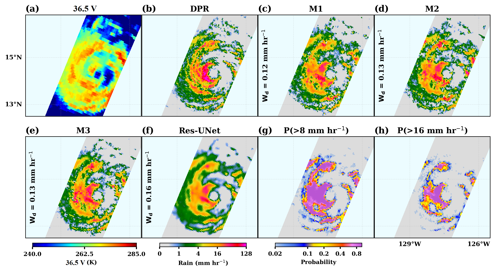
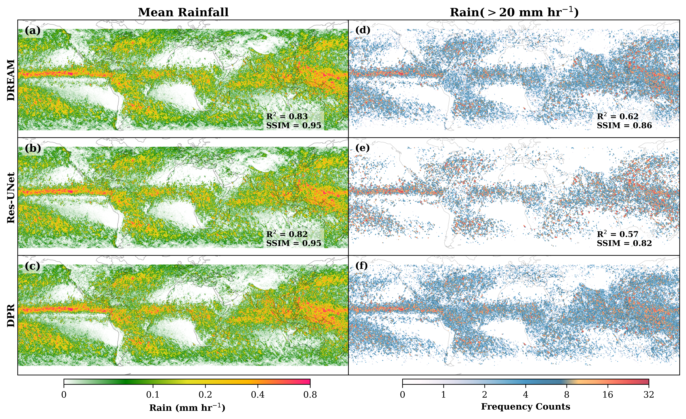

[](https://colab.research.google.com/github/Buddha-subedi/DREAM/blob/main/DREAM_demo.ipynb)
# An Attention-based Conditional Diffusion Model for Super-resolved Stochastic Passive Microwave Satellite Rainfall Retrievals
## Abstract
<strong>
This repository introduces Diffusion-based PMW Rainfall rEtrievals with Attention Mechanisms (DREAM), a two-stage probabilistic framework for super-resolved PMW retrieval at near-global scale. First, a residual U-Net (Res-UNet) trained with mean squared error (MSE) and sliced Wasserstein distance loss generates coarse deterministic estimates at Global Precipitation Measurement (GPM) Microwave Imager (GMI) resolution. Second, a conditional denoising diffusion probabilistic model (DDPM) learns the residual toward high-resolution Dual-frequency Precipitation Radar (DPR) targets, fusing multi-frequency brightness temperatures and reanalysis variables through channel, cross-, self-, and bottleneck dual-attention mechanisms. Evaluated on 2023 GPM overpasses, including Hurricane Calvin, DREAM substantially outperforms deterministic baselines in spatial variability, extreme precipitation frequency, and power spectral fidelity.
<strong>

<a name="4"></a> <br>
## Code

<a name="41"></a> <br>
###   Setup
To run this notebook on Google Colab, clone this repository
```python
!git clone https://github.com/Buddha-subedi/DREAM.git
os.chdir("PMWPrecip_TLP-R2S")
```

### Timestep Embedding
```python
def timestep_embedding(timesteps, dim, max_period=10000, device=None):
    if device is None:
        device = timesteps.device
    
    half = dim // 2
    max_period_tensor = torch.tensor(max_period, dtype=torch.float32, device=device)
    
    freqs = torch.exp(
        -torch.log(max_period_tensor) * 
        torch.arange(half, dtype=torch.float32, device=device) / half
    )
    args = timesteps[:, None].float() * freqs[None]
    embedding = torch.cat([torch.cos(args), torch.sin(args)], dim=-1)
    if dim % 2:
        embedding = torch.cat([embedding, torch.zeros_like(embedding[:, :1])], dim=-1)
    return embedding
```
<a name="42"></a> <br>
 ### Channel Attention
 
```python
class ChannelAttention(nn.Module):
    """Channel attention matching:
       AvgPool/MaxPool -> Conv -> ReLU -> Conv -> Add -> Sigmoid -> Multiply
    """
    def __init__(self, channels, reduction_ratio=16):
        super().__init__()

        reduced_channels = max(1, channels // reduction_ratio)

        self.avg_pool = nn.AdaptiveAvgPool2d(1)
        self.max_pool = nn.AdaptiveMaxPool2d(1)

        # Shared MLP implemented with 1x1 convolutions
        self.shared_mlp = nn.Sequential(
            nn.Conv2d(channels, reduced_channels, kernel_size=1, bias=False),
            nn.ReLU(inplace=True),
            nn.Conv2d(reduced_channels, channels, kernel_size=1, bias=False)
        )

        self.sigmoid = nn.Sigmoid()

    def forward(self, x):
        # Two channel descriptors
        avg_out = self.shared_mlp(self.avg_pool(x))   # (B, C, 1, 1)
        max_out = self.shared_mlp(self.max_pool(x))   # (B, C, 1, 1)

        # Add, then sigmoid
        attention = self.sigmoid(avg_out + max_out)   # (B, C, 1, 1)

        # Multiply with input feature map
        out = x * attention

        return out
```

<p align="center">
  
</p>

<p align="center"><em>Schematic of the DREAM architecture. (a) A Res-UNet generates deterministic rainfall retrievals at the native radiometric resolution, while an attention-enhanced conditional diffusion model learns and generates rainfall residuals relative to DPR observations. (b) Forward and reverse diffusion processes. (c) U-Net backbone. (d) Cross-attention module. (e) Channel-attention module. (f) Dual-attention bottleneck combining cross- and channel-attention to fuse GMI brightness temperatures and ERA5 variables across multiple spatial scales.</em></p>


<a name="43"></a> <br>
 ### Orbital Retrievals
<p align="center">
  
</p>
<p align="center">
  <em>Hurricane Calvin on 15 July 2023 captured by the GPM orbit 053278 over the Pacific basin. (a) The GMI observations at vertically polarized 36.5~GHz, (b) the reference DPR active retrievals, (c--e) three stochastic DREAM ensembles (M1-M3) via learned residual added to (f) the deterministic Res-UNet retrievals, and the exceedance probabilities for rainfall rates of (g) 8 and (h) 16 mm hr<sup>−1</sup> obtained from 100 ensemble members.</em>
</p>


<a name="44"></a> <br>
 ### Annual Retrievals
```python
[phase, rain, snow, latitude, longitude] = TLPR2S_model(path_orbit_004780, booster, snow_rate_booster, rain_rate_booster, df_cdf_rain, df_cdf_snow);
```
<p align="center">
  
</p>
<p align="center">
  <em>Annual mean rainfall rates per revisit from (a) DREAM, (b) Res-UNet, and (c) DPR observations for all the overpasses during 2023, and (d--f) the corresponding frequency counts of retrieved rates exceeding 20 mm hr<sup>−1</sup>.</em>
</p>


## Dataset
The complete dataset for training the networks and retrieving sample orbits is available here: (https://drive.google.com/drive/folders/1NwouPlF4kF2kdHWRwpCHfHnjyaW14xzP?usp=sharing).
